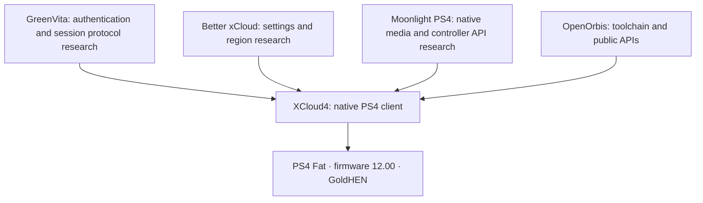

# Planned architecture

This plan comes from the original conversation, “Buscar xCloud en PS4.” Compatibility proposals require evidence from source and the owner's console.

The initial conversation mentioned firmware 11.00. On October 8, the owner confirmed **12.00** with GoldHEN enabled. That replaces the original target. Confirmed milestones through 0.6.2 use this console.

The laptop is used for development and compilation. The final goal is for PS4 to receive the game directly from Xbox Cloud Gaming.

## Decisions

- Use the existing Lubuntu VM; do not create another VM or install WSL.
- Use C/C++ with OpenOrbis, starting from a minimal C entry point.
- Keep NAT during environment preparation.
- Establish video/audio/controller feasibility before expanding the interface.
- Review whether firmware-specific patches are necessary on 12.00 before incorporating any.
- Publish only when authorized. The owner has now requested a **private** GitHub repository with English content; the PS4 interface remains Spanish.

## Current boundary

The own native UI, local H.264/PCM sample, account, catalog, remote preparation and connection authorization are confirmed. Receiving actual game video/audio and sending Xbox controller messages are still under development. See [the roadmap](../README.md) and [WebRTC adaptation](WEBRTC_PS4.md).
