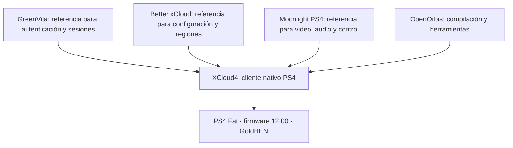

# Arquitectura prevista

Este plan proviene de la conversación original “Buscar xCloud en PS4”. Sus propuestas de compatibilidad están pendientes de comprobar en código y en la consola.

La conversación inicial mencionaba firmware 11.00. El 8 de octubre el propietario confirmó que su consola está en **12.00**, con GoldHEN activado. Esa versión sustituye el objetivo inicial; la compatibilidad se comprobará en esa consola.

La laptop se utiliza para desarrollar y compilar. El objetivo final es que la PS4 reciba el juego directamente desde Xbox Cloud Gaming.

## Decisiones iniciales

- Usar la máquina de Lubuntu existente; no crear otra máquina ni instalar WSL.
- Usar C/C++ con OpenOrbis, comenzando con una entrada mínima en C.
- Mantener NAT durante la preparación.
- Priorizar la viabilidad de video/audio/control antes de desarrollar toda la interfaz.
- Evitar incorporar parches de otro firmware sin revisar su necesidad en 12.00.
- Mantener el repositorio local hasta que se solicite su publicación.
